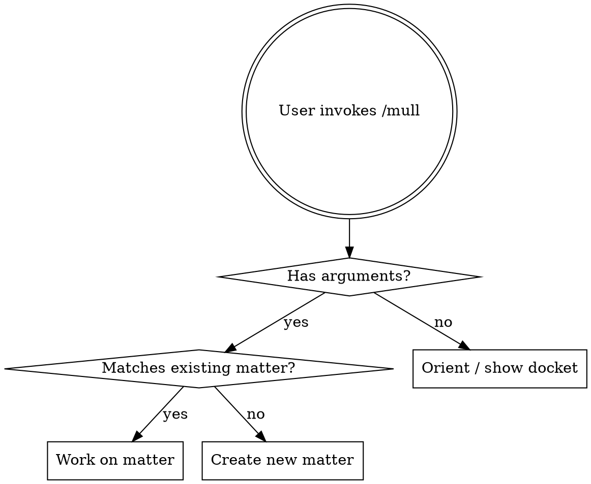

# mull Skills - Design Document

A single Claude Code skill that wraps the `mull` CLI, enabling conversational workflows for capturing, refining, and working with matters.

## Location + Installation

The skill ships with the mull repo:

```
mull/
  skills/
    SKILL.md
```

Installed via symlink:

```bash
ln -s /path/to/mull/skills ~/.claude/skills/mull
```

This could be part of a `mull install` command that also puts the binary on PATH.

## Skill Frontmatter

```yaml
---
name: mull
description: Use when discussing project ideas, features, or priorities - working on existing matters, capturing new ones, or consulting the docket/roadmap
---
```

## Mode Detection

The skill is a single entry point that detects which mode to enter from context:



- `/mull` with no args: call `mull prime`, show the landscape, ask what to work on
- `/mull dark mode` matching an existing matter: pull it into context, start refining
- `/mull add search to the blog` not matching anything: create a new matter, start fleshing it out

In all cases, the skill starts by calling `mull prime` to orient itself.

## Matter Shapes

Matters vary in weight and intent. The skill calibrates its behavior accordingly rather than funneling everything toward a plan doc.

| Shape | Example | Behavior |
|-------|---------|----------|
| **Tickler** | "idea for a new logo" | Captured, tagged, maybe a sentence or two. Sits in raw. Done in 30 seconds. |
| **Sketch** | "what if we added search?" | Some back-and-forth to flesh out the idea, capture constraints and open questions. Lands at refined. |
| **Spec** | "redesign the nav hierarchy" | Deep exploration, detailed requirements, relationships to other matters. May eventually become planned, but isn't forced there. |
| **Task** | "fix the broken RSS link" | Small, actionable, could be executed right now or captured for later. |

These are not formal types in the schema. There is no `shape` field. They describe how the skill matches the user's energy and intent.

## Skill Behavior

### Orientation (always runs first)

1. Run `mull prime` to get the current landscape
2. If `$ARGUMENTS` provided:
   - Run `mull search <args>` to find a matching matter
   - Match found: enter "work on matter" flow
   - No match: enter "create new matter" flow
3. If no arguments: present the landscape concisely and ask what to work on

### Working on a Matter

1. Run `mull show <id>` and `mull graph <id>`
2. Present the matter to the user conversationally
3. Follow the user's lead:
   - Capture new details: `mull append <id> "<text>"`
   - Update metadata: `mull set <id> <key> <value>`
   - Create relationships: `mull link <id> <type> <id>`
4. If the user moves to other skills or work, hold the matter context
5. When returning from other work, offer to capture outcomes back into the matter
6. Only suggest creating a plan doc if the user explicitly wants to move toward execution on something substantial

### Creating a New Matter

1. `mull add "<title>" --status raw`
2. Ask one clarifying question at a time to flesh it out
3. Append details as they emerge via `mull append`
4. Check against `mull prime` output for relationships to existing matters
5. Match the user's energy: a tickler is done in 30 seconds, a spec takes a session

### Docket Consultation

Triggered when user asks "what next?", "show me the roadmap", or similar:

1. `mull docket` for the prioritized sequence
2. `mull graph` for the dependency picture
3. Identify the first unblocked matter on the docket
4. Present options conversationally, don't dictate

## Capturing Results From Other Work

When the user invokes other skills mid-session (debugging, code review, codebase exploration, etc.), the mull skill instructs the LLM:

> If you have an active matter in context and complete work related to it via any skill or direct action, update the matter with what was learned or decided. Use `mull append` for findings and `mull set` for status/metadata changes.

This is guidance that creates the habit of writing outcomes back to the matter. Nothing is lost if a session ends unexpectedly because the skill captures as it goes, not at the end.

## Key Principles

- **Capture as you go.** Don't wait until the end to write things down. Every meaningful detail gets appended or set on the matter immediately.
- **Match the user's energy.** A tickler is not a spec. Don't over-process lightweight matters.
- **Don't push toward planning.** Only suggest a plan doc when the user signals they want to move to execution on something substantial.
- **Stay concise.** The skill body targets ~150-200 words of instruction to stay within token budget for a frequently-loaded skill.
