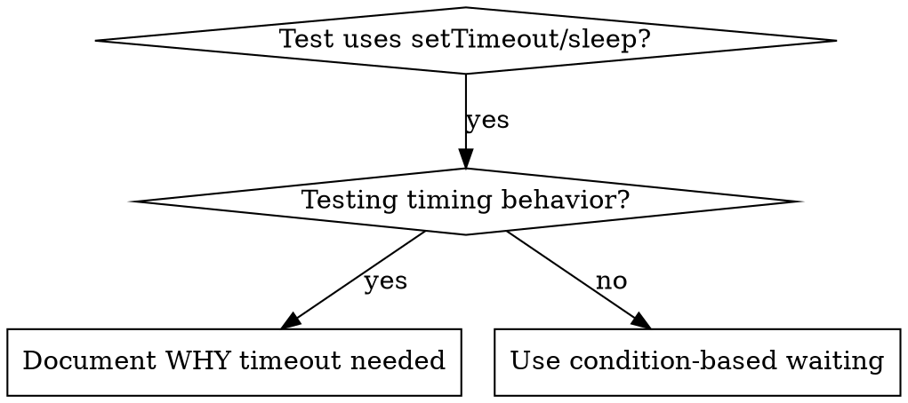

# Condition-Based Waiting

## Overview

Flaky tests often guess at timing with arbitrary delays. This creates race conditions where tests pass on fast machines but fail under load or in CI.

**Core principle:** Wait for the actual condition you care about, not a guess about how long it takes.

## When to Use



**Use when:**
- Tests have arbitrary delays (`setTimeout`, `sleep`, `Process.sleep`, `time.Sleep`)
- Tests are flaky (pass sometimes, fail under load)
- Tests timeout when run in parallel
- Waiting for async operations to complete

**Don't use when:**
- Testing actual timing behavior (debounce, throttle intervals)
- Always document WHY if using arbitrary timeout

## Core Pattern

```elixir
# BEFORE: Guessing at timing
Process.sleep(50)
result = get_result()
assert result != nil

# AFTER: Waiting for condition
result = eventually(fn -> get_result() end)
assert result != nil
```

## Quick Patterns

| Scenario | Pattern |
|----------|---------|
| Wait for event | `eventually(fn -> find_event(events, :done) end)` |
| Wait for state | `eventually(fn -> get_state(pid) == :ready end)` |
| Wait for count | `eventually(fn -> length(items) >= 5 end)` |
| Wait for file | `eventually(fn -> File.exists?(path) end)` |

## Implementation

Generic polling function (Elixir):
```elixir
def eventually(func, opts \\ []) do
  timeout = Keyword.get(opts, :timeout, 5_000)
  interval = Keyword.get(opts, :interval, 10)
  deadline = System.monotonic_time(:millisecond) + timeout

  do_eventually(func, interval, deadline)
end

defp do_eventually(func, interval, deadline) do
  case func.() do
    nil ->
      if System.monotonic_time(:millisecond) > deadline do
        raise "Timeout waiting for condition"
      end
      Process.sleep(interval)
      do_eventually(func, interval, deadline)

    false ->
      if System.monotonic_time(:millisecond) > deadline do
        raise "Timeout waiting for condition"
      end
      Process.sleep(interval)
      do_eventually(func, interval, deadline)

    result ->
      result
  end
end
```

Generic polling function (Go):
```go
func eventually(t *testing.T, condition func() bool, timeout time.Duration) {
    t.Helper()
    deadline := time.Now().Add(timeout)
    for time.Now().Before(deadline) {
        if condition() {
            return
        }
        time.Sleep(10 * time.Millisecond)
    }
    t.Fatal("Timeout waiting for condition")
}
```

## Common Mistakes

**Polling too fast:** `time.Sleep(1ms)` — wastes CPU
**Fix:** Poll every 10ms

**No timeout:** Loop forever if condition never met
**Fix:** Always include timeout with clear error

**Stale data:** Cache state before loop
**Fix:** Call getter inside loop for fresh data

## When Arbitrary Timeout IS Correct

```elixir
# Tool ticks every 100ms - need 2 ticks to verify partial output
:ok = wait_for_event(manager, :tool_started)  # First: wait for condition
Process.sleep(200)                              # Then: wait for timed behavior
# 200ms = 2 ticks at 100ms intervals - documented and justified
```

**Requirements:**
1. First wait for triggering condition
2. Based on known timing (not guessing)
3. Comment explaining WHY
