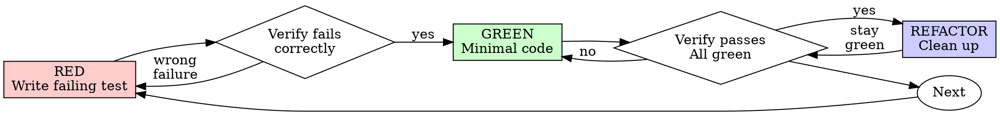

# Test-Driven Development (TDD)

## Overview

Write the test first. Watch it fail. Write minimal code to pass.

**Core principle:** If you didn't watch the test fail, you don't know if it tests the right thing.

**Violating the letter of the rules is violating the spirit of the rules.**

## When to Use

**Always:**
- New features
- Bug fixes
- Refactoring
- Behavior changes

**Exceptions (ask your human partner):**
- Throwaway prototypes
- Generated code
- Configuration files

Thinking "skip TDD just this once"? Stop. That's rationalization.

## The Iron Law

```
NO PRODUCTION CODE WITHOUT A FAILING TEST FIRST
```

Write code before the test? Delete it. Start over.

**No exceptions:**
- Don't keep it as "reference"
- Don't "adapt" it while writing tests
- Don't look at it
- Delete means delete

Implement fresh from tests. Period.

## Red-Green-Refactor



### RED - Write Failing Test

Write one minimal test showing what should happen.

**TypeScript:**

<Good>
```typescript
test('retries failed operations 3 times', async () => {
  let attempts = 0;
  const operation = () => {
    attempts++;
    if (attempts < 3) throw new Error('fail');
    return 'success';
  };

  const result = await retryOperation(operation);

  expect(result).toBe('success');
  expect(attempts).toBe(3);
});
```
Clear name, tests real behavior, one thing
</Good>

**Elixir:**

<Good>
```elixir
test "retries failed operations 3 times" do
  {:ok, counter} = Agent.start_link(fn -> 0 end)

  operation = fn ->
    count = Agent.get_and_update(counter, &{&1 + 1, &1 + 1})
    if count < 3, do: {:error, "fail"}, else: {:ok, "success"}
  end

  assert {:ok, "success"} = retry(operation, max_attempts: 3)
  assert Agent.get(counter, & &1) == 3
end
```
Clear name, tests real behavior, pattern matches on expected shape
</Good>

<Bad>
```elixir
test "retry works" do
  mock = Mox.stub(RetryMock, :call, fn -> {:ok, "done"} end)
  assert retry(mock) == {:ok, "done"}
end
```
Vague name, tests mock not code
</Bad>

**Requirements:**
- One behavior
- Clear name
- Real code (no mocks unless unavoidable)

### Verify RED - Watch It Fail

**MANDATORY. Never skip.**

```bash
# Elixir
mix test test/path/to/test.exs:LINE

# Go
go test ./path/to/package -run TestName -v

# TypeScript
npm test path/to/test.test.ts
```

Confirm:
- Test fails (not errors)
- Failure message is expected
- Fails because feature missing (not typos)

**Test passes?** You're testing existing behavior. Fix test.

**Test errors?** Fix error, re-run until it fails correctly.

### GREEN - Minimal Code

Write simplest code to pass the test.

**Elixir:**

<Good>
```elixir
def retry(operation, opts \\ []) do
  max = Keyword.get(opts, :max_attempts, 3)
  do_retry(operation, max, 1)
end

defp do_retry(operation, max, attempt) do
  case operation.() do
    {:ok, _} = success -> success
    {:error, _} when attempt >= max -> {:error, "max attempts reached"}
    {:error, _} -> do_retry(operation, max, attempt + 1)
  end
end
```
Just enough to pass
</Good>

<Bad>
```elixir
def retry(operation, opts \\ []) do
  max = Keyword.get(opts, :max_attempts, 3)
  backoff = Keyword.get(opts, :backoff, :exponential)
  on_retry = Keyword.get(opts, :on_retry, fn _ -> :ok end)
  jitter = Keyword.get(opts, :jitter, true)
  # YAGNI
end
```
Over-engineered
</Bad>

Don't add features, refactor other code, or "improve" beyond the test.

### Verify GREEN - Watch It Pass

**MANDATORY.**

```bash
mix test test/path/to/test.exs:LINE
go test ./path/to/package -run TestName -v
npm test path/to/test.test.ts
```

Confirm:
- Test passes
- Other tests still pass
- Output pristine (no errors, warnings)

**Test fails?** Fix code, not test.

**Other tests fail?** Fix now.

### REFACTOR - Clean Up

After green only:
- Remove duplication
- Improve names
- Extract helpers

Keep tests green. Don't add behavior.

### Repeat

Next failing test for next feature.

## Phoenix-Specific Guidance

When working on Phoenix LiveView features, test in layers:

1. **Context functions first (unit tests):** Test the business logic in context modules. These are pure functions operating on data — fast, isolated, easy to TDD.

```elixir
# Test the context
test "list_active_matters/1 excludes done matters" do
  project = project_fixture()
  active = matter_fixture(project, status: :active)
  _done = matter_fixture(project, status: :done)

  assert [^active] = Matters.list_active_matters(project)
end
```

2. **LiveView interactions second (integration tests):** Once context functions work, test that the LiveView wires them up correctly.

```elixir
# Test the LiveView uses the context correctly
test "displays only active matters", %{conn: conn} do
  project = project_fixture()
  matter_fixture(project, status: :active, title: "Active one")
  matter_fixture(project, status: :done, title: "Done one")

  {:ok, view, _html} = live(conn, ~p"/projects/#{project}")

  assert has_element?(view, "#matters", "Active one")
  refute has_element?(view, "#matters", "Done one")
end
```

**Don't skip the context layer.** If the LiveView test fails, you want to know whether it's the business logic or the UI wiring.

## Good Tests

| Quality | Good | Bad |
|---------|------|-----|
| **Minimal** | One thing. "and" in name? Split it. | `test('validates email and domain and whitespace')` |
| **Clear** | Name describes behavior | `test('test1')` |
| **Shows intent** | Demonstrates desired API | Obscures what code should do |

## Why Order Matters

**"I'll write tests after to verify it works"**

Tests written after code pass immediately. Passing immediately proves nothing:
- Might test wrong thing
- Might test implementation, not behavior
- Might miss edge cases you forgot
- You never saw it catch the bug

Test-first forces you to see the test fail, proving it actually tests something.

**"Deleting X hours of work is wasteful"**

Sunk cost fallacy. The time is already gone. Your choice now:
- Delete and rewrite with TDD (X more hours, high confidence)
- Keep it and add tests after (30 min, low confidence, likely bugs)

The "waste" is keeping code you can't trust.

## Common Rationalizations

| Excuse | Reality |
|--------|---------|
| "Too simple to test" | Simple code breaks. Test takes 30 seconds. |
| "I'll test after" | Tests passing immediately prove nothing. |
| "Tests after achieve same goals" | Tests-after = "what does this do?" Tests-first = "what should this do?" |
| "Already manually tested" | Ad-hoc ≠ systematic. No record, can't re-run. |
| "Deleting X hours is wasteful" | Sunk cost fallacy. Keeping unverified code is technical debt. |
| "Keep as reference, write tests first" | You'll adapt it. That's testing after. Delete means delete. |
| "Need to explore first" | Fine. Throw away exploration, start with TDD. |
| "Test hard = design unclear" | Listen to test. Hard to test = hard to use. |
| "TDD will slow me down" | TDD faster than debugging. |
| "Existing code has no tests" | You're improving it. Add tests for existing code. |

## Red Flags - STOP and Start Over

- Code before test
- Test after implementation
- Test passes immediately
- Can't explain why test failed
- Tests added "later"
- Rationalizing "just this once"
- "I already manually tested it"
- "Tests after achieve the same purpose"
- "Keep as reference" or "adapt existing code"
- "This is different because..."

**All of these mean: Delete code. Start over with TDD.**

## Verification Checklist

Before marking work complete:

- [ ] Every new function/method has a test
- [ ] Watched each test fail before implementing
- [ ] Each test failed for expected reason (feature missing, not typo)
- [ ] Wrote minimal code to pass each test
- [ ] All tests pass
- [ ] Output pristine (no errors, warnings)
- [ ] Tests use real code (mocks only if unavoidable)
- [ ] Edge cases and errors covered

Can't check all boxes? You skipped TDD. Start over.

## When Stuck

| Problem | Solution |
|---------|----------|
| Don't know how to test | Write wished-for API. Write assertion first. Ask your human partner. |
| Test too complicated | Design too complicated. Simplify interface. |
| Must mock everything | Code too coupled. Use dependency injection. |
| Test setup huge | Extract helpers. Still complex? Simplify design. |

## Debugging Integration

Bug found? Write failing test reproducing it. Follow TDD cycle. Test proves fix and prevents regression.

Never fix bugs without a test.

## Testing Anti-Patterns

When adding mocks or test utilities, read `testing-anti-patterns.md` in this directory to avoid common pitfalls:
- Testing mock behavior instead of real behavior
- Adding test-only methods to production classes
- Mocking without understanding dependencies

## Final Rule

```
Production code -> test exists and failed first
Otherwise -> not TDD
```

No exceptions without your human partner's permission.
